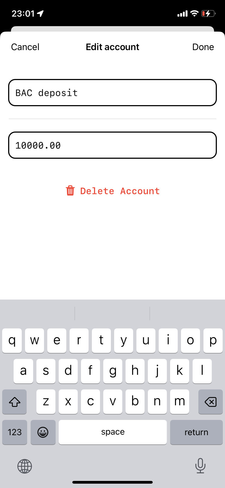

# Budgetio

Budgetio - the app which allows you to track proportions of your accounts

	
	

## Features

- Pure SwiftUI
- No third party libraries
- WidgetKit
- Core Data

## Requirements

- iOS 16+
- Swift 5.7

## History and Plans

- [x] Create and upload to AppStore
- [ ] Create onboarding screen
- [ ] Integrate fastlane / firebase
- [ ] Add analytics
- [ ] Add unit tests

## Links

- [AppStore](https://apps.apple.com/us/app/Budgetio/id6444619357)
- [Site](https://alobanov11.ru/)